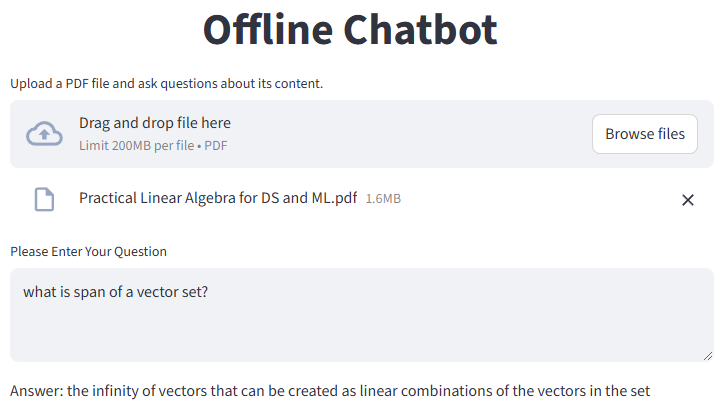

# Offline Chatbot

An intelligent, fully offline chatbot application that enables you to upload PDF documents and ask questions about their content. This chatbot runs completely locally without any network calls, making it perfect for processing documents.

## Features

- 🔒 **Fully Offline**: Works entirely offline with no external API calls
- 📄 **PDF Support**: Upload PDF files and ask questions about their content
- 🤖 **Advanced NLP**: Uses state-of-the-art transformer models for embeddings and text generation
- ⚡ **Fast Similarity Search**: Powered by Elasticsearch for efficient vector-based retrieval
- **Answers**: Flan-T5-Small model generates contextual answers based on PDF content
- **GPU Support**: Automatically uses a GPU when available, otherwise defaults to the CPU.

## Demo



## Project Structure

```
Local_chatbot/
├── chatbot-app.py                   
├── all-mpnet-base-v2/        # Sentence embeddings model (NOT pushed to GitHub)
├── google_flan_t5_small/     # Text generation model (NOT pushed to GitHub)
├── imgs/
│   └── offline_chatbot.PNG          # Application screenshot
├── chatbotEnv/                      # Python virtual environment
├── Practical Linear Algebra for DS and ML.pdf  # A sample PDF
```

## Technology Stack

- **Frontend**: [Streamlit](https://streamlit.io/) - Interactive web UI
- **Embeddings**: `sentence-transformers` (all-mpnet-base-v2) - Document embeddings
- **LLM**: Flan-T5-Small - Text generation
- **Vector Database**: Elasticsearch - Efficient semantic search
- **Framework**: LangChain - Orchestration of NLP components
- **PDF Processing**: PyMuPDF & PyPDFium2

## Large Folders Not Pushed to GitHub

The following folders are **not included in this repository** due to their large file sizes:

### `all-mpnet-base-v2/` (~3.9GB)
- Contains the sentence-transformers embedding model
- Used for encoding PDF content into vector embeddings
- Essential for similarity search functionality

### `google_flan_t5_small/` (~1.2GB)
- Contains the Flan-T5-Small language model
- Used for generating contextual answers

**To use this project**, you'll need to download these models from [HuggingFace](https://huggingface.co). 

## Usage

```bash
# Run the Streamlit application
streamlit run chatbot-app.py
```

The application will open in your browser at `http://localhost:8501`

1. Upload a PDF file
2. Wait for processing to complete
3. Enter your question in the text area
4. Get instant answers based on the PDF content

## How It Works

1. **PDF Upload**: User uploads a PDF document through the Streamlit interface
2. **Extraction**: Document is parsed using PyMuPDF to extract text
3. **Embedding**: Text chunks are converted to vector embeddings using `all-mpnet-base-v2`
4. **Indexing**: Embeddings are stored in Elasticsearch for fast retrieval
5. **Query Processing**: User question is converted to embeddings
6. **Similarity Search**: Most relevant document chunks are retrieved from Elasticsearch
7. **Answer Generation**: Flan-T5-Small model generates contextual answers using retrieved context
8. **Response**: Answer is displayed to the user

## Performance Notes

- **First Run**: Expect 30-60 seconds for model loading on first use
- **GPU Acceleration**: Model automatically detects and uses GPU if available
- **PDF Processing**: Processing time depends on PDF size (larger PDFs take longer)

## Troubleshooting

**Q: Models not found error**
- Ensure models are downloaded to correct paths: `./all-mpnet-base-v2` and `./google_flan_t5_small`

**Q: Elasticsearch connection error**
- Verify Elasticsearch is running on `http://localhost:9200`
